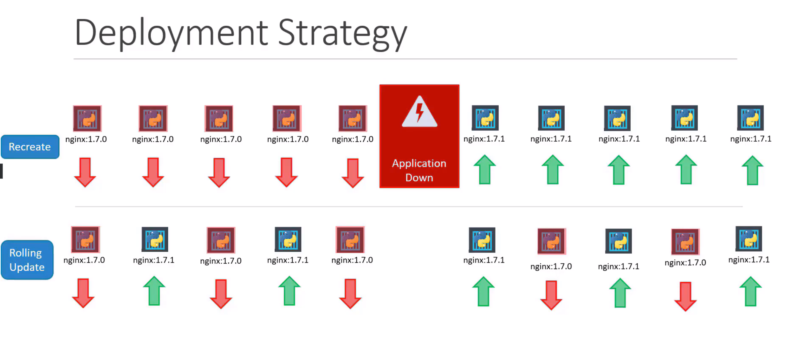
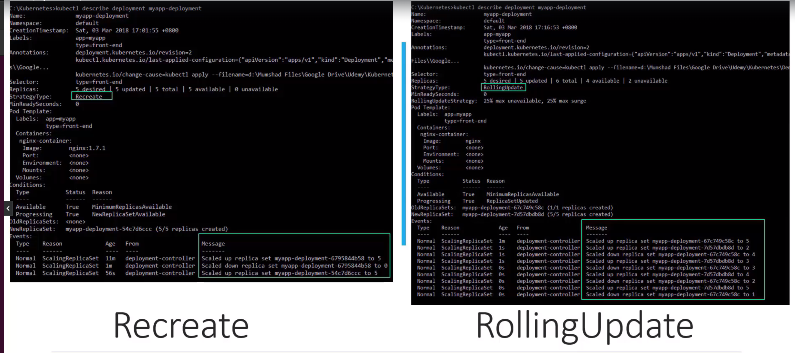
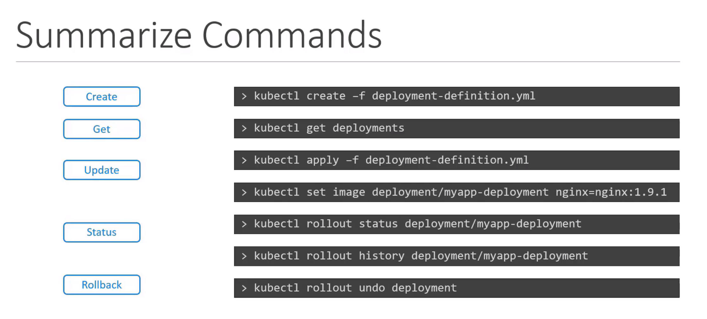

##  Rolling updates
-  when you upgrade your instances, you do not want to upgrade all of them at once as we just did. This may impact users accessing our applications, so you may want to upgrade them one after the other. And that kind of upgrade is known as  Rolling Updates.
- Suppose one of the upgrades you performed resulted in an unexpected error and you are asked to undo the recent update. You would like to be able to rollBACK the changes that were recently carried out. 
- Finally, say for example you would like to make multiple changes to your environment such as upgrading the underlying WebServer versions, as well as scaling your environment and also modifying the resource allocations etc. You do not want to apply each change immediately after the command is run, instead you would like to apply a pause to your environment, make the changes and then resume so that all changes are rolled-out together.

## Definition 

- Definion file for deployment is same as for replicaset, except the `kind` is `deployment`

## Commands

`kubectl get all`

## Updates and Rollback

1. Rollout Command
`kubectl rollout status deployment/myapp-deployment`
`kubectl rollout history deployments/myapp-deployment`

2. deployment strategy 
- destroy instances --> create new one  by one 

-> default strategy 

- run `kubectl apply` after modifying details in the yaml file (i.e: image)\
or 
- `kubectl set image deployment/myapp-deployment container-name=new-image` 
--> doing this way might result in deployment yaml file and actual deployment with different configurations. \

- Difference between recreated update (delete to recreate ) and rolling update 

2. Upgrades /rollback

`kubectl rollout undo deployment/myapp-deployment`

## Summary 

--record: to record the history of rollout 