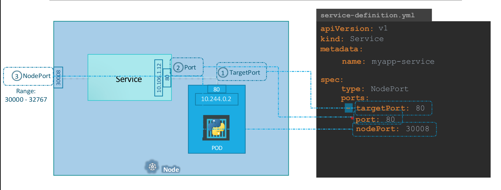

## Pod

- IP address is assigned to pod 
- IP address is changed when pod is recreated
## Cluster Networking

- Kubernetes doesn't automatically set up so that pods are assigned different IP addresses
- Fundamental rules: 
1. All the containers or PODs in a kubernetes cluster MUST be able to communicate with one another without having to configure NAT.
--> solutions available in the industry. 

## Services 

Kubernetes Services enable communication between various components within and
outside of the application. Kubernetes Services helps us connect applications
together with other applications or users. 

### Nodeport service

- Listen to a port on the Node and forward requests on that port to a port on the POD running the web application.
- **NodePort** is the service makes an internal POD accessible on a Port on the Node.
- Port on pod: **target pod**
- Port on service. The service is in fact like a virtual server inside the node. Inside the cluster it has its own IP address. And that IP address is called the **Cluster-IP of the service**
- Port on the Node itself which we use to access the web server externally. **NodePorts** can only be in a valid range which is from 30000 to 32767

-  Cluster IP: the service creates a virtual IP inside the cluster to enable communication between different services. 

- There could be multiple port mappings within a single service. 

To link the service to the pod, bring the `labels` section of `pod-definition.yaml` to `selector`

![[Pasted_image_20240626085826.png]]

- In the production's env, service file with match `selector` with `labels` of pod, service will then distribute the balance automatically. It also map the pod to the nodeport, making it available to users. 

### Cluster IP

![[Pasted image 20240626094726.png]]
- The `targetPort` is the port where the backend is exposed 
- The `port` is where the service is exposed 

### Load balancer

[Differences between Nodeport, ClusterIP, and Loadbalancer](
https://stackoverflow.com/questions/41509439/difference-between-clusterip-nodeport-and-loadbalancer-service-types-in-kuberne )