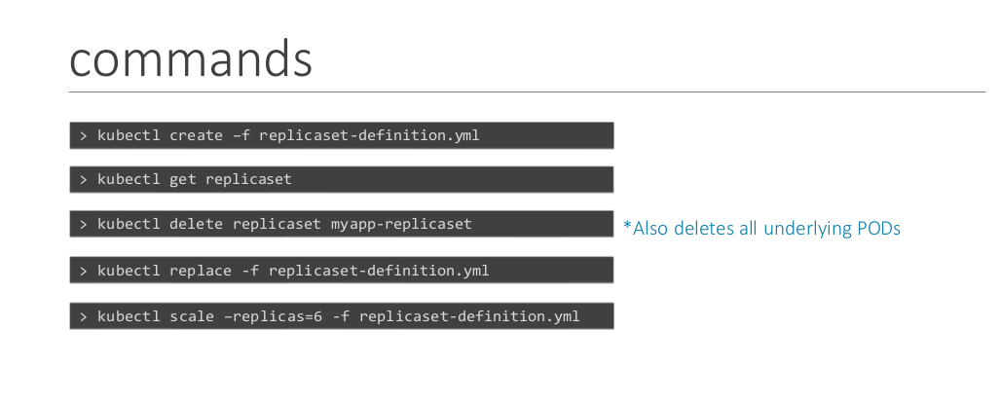

## Replica 

- The replication controller helps us run multiple instances of a single POD in the kubernetes cluster thus providing High Availability.\
- Even if you have a single POD, the replication controller can help by
automatically bringing up a new POD when the existing one fails.
- Replication Controller span across multiple nodes in the cluster --> help to balance the load across multiple pods, nodes as well as our applications 

| Replication Controller | Replica Set |
| ---------------------- | ----------- |
|                        |             |

## Create a replica controller 

```
apiVersion: v1 
kind: ReplicationController
metadata:
	name: myapp-rc
	type: frontend

spec: 
	template:
		metadata:
			name: myapp-pod
			labels: 
				app:myapp
		spec: 
			containers:
			- name: nginx-container
			  image: nginx 
	replicas: 3
		
```


- Under `spec`, template is used to specify the template of the pod to be use for the replica: move everything from the `pod.yaml` except for the 2 first fields (i.e: apiVersion, kind)
- now we have 2 spec, 2 metadata

- To create the replication controller from the file: 
`kubectl create -f rc-definition.yaml`
- To check the status of  it: 
`kubectl get replicationcontroller`
- check what pods the replica is running on:
`kubectl get pods`
--> name of pod would start with name of the replica 


## Create a replica set 


```
apiVersion: apps/v1
kind: ReplicaSet
metadata: 
  name: myapp- replicaset
  labels:
	  app:myapp
	  type: front-end
	  


spec: 
	template:
		metadata:
			name: myapp-pod
			labels: 
				app:myapp
				type: front-end
		spec: 
			containers:
			- name: nginx-container
			  image: nginx 
	
	replicas: 3
	selector: 
		matchLabels:
		  type: front-end
	
	

```

**Note:** `matchLabels` under `selector` have to match with `labels` of the pod `template`

- But why would you have to specify what PODs fall under it, if you have provided the contents of the pod-definition file itself in the template? It’s BECAUSE, replica set can ALSO manage pods that were not created as part of the replicaset creation.

- Replicaset ensures that there's always sufficient amount of replica of pods are present on the cluster


To get the replica: 
`kubectl get replicaset` 
or `kubectl get rs`

![[Pasted image 20240621082046.png]]
- In the event that `replica` is specified to 3, trying to create another pod which falls under the template section of the replica definition will get that pod terminated right away. 


## Labels and Selectors

- The role of the replicaset is to monitor the pods and if any of them were to fail, deploy new ones. In case they were not created, the replica set will create them for you.
- The replica set is in FACT a process that monitors the pods.
- How does the replicaset KNOW what pods to monitor?  Under the selector section we use the `matchLabels` filter and provide the same label that we used while creating the pods. This way the replicaset knows which pods to monitor.
-  in case one of the PODs were to fail in the future, the replicaset needs to create a new one to maintain the desired number of PODs. And for the replica set to create a new POD, the template definition section IS required.


## Scale 


1. To apply new changes from the newly updated yaml file 
`kubectl replace -f replicaset-definition.yaml`
2. From command line : this won't modify the file directly 
`kubectl scale --replicas=6 -f replicaset-definition.yaml`
3. type- name
`kubectl scale --replicas=6 replicaset myapp-replicaset`
4. to edit
`kubectl edit rs myapp-replicaset`


## Commands 




## References 

https://kubernetes.io/docs/concepts/workloads/controllers/replicaset/#replicaset-as-an-
horizontal-pod-autoscaler-target